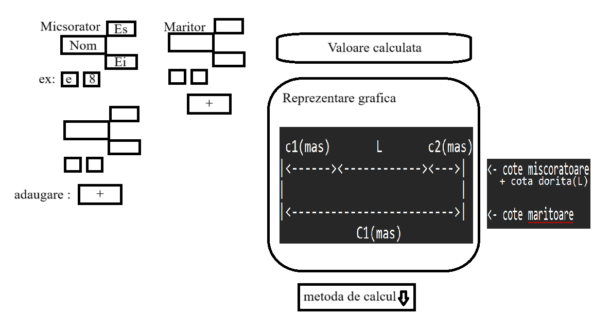

# Chain of Dimensions Calc

This project calculates dimensions in a chain of dimensions based on user input from a graphical interface. The application is designed using the raygui library, providing a simple and intuitive front panel for users to interact with.

## Features

- Takes from user the nominal value and its upper and lower deviation for the increasing dimension:

- takes up to 5 reducing dimensions and their deviations

- you can add or remove reucing dimensions with buttons next to "Cote Micsoratoare"

- Display of calculated value of the unknown dimension in the chain of dimensions

## Dependencies

This project requires the raylib and raygui to be installed

## Build & Run

**gcc main.c -o main.exe -lraylib**
**./main.exe**

## Plan

This is how I plan for the fornt panel to look:

