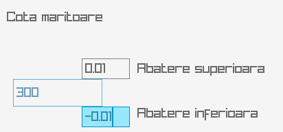
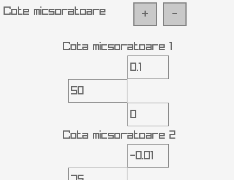
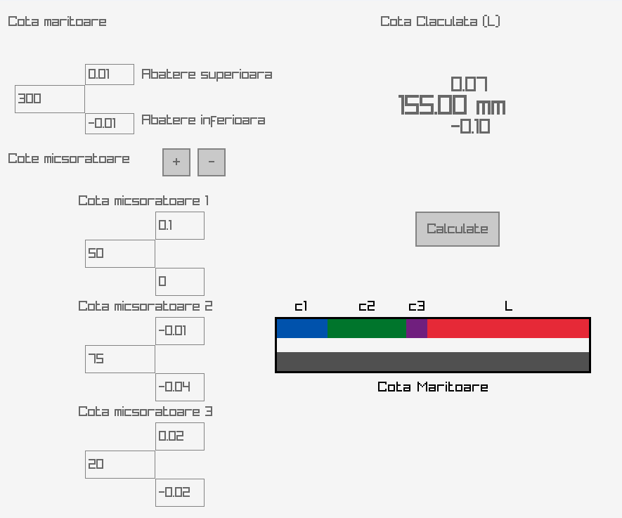
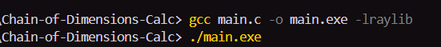

# Chain of Dimensions Calc

This project calculates dimensions in a chain of dimensions based on user input from a graphical interface. The application is designed using the raygui library, providing a simple and intuitive front panel for users to interact with.

## Features

- Takes the nominal value and its upper and lower deviation for the increasing dimension from the user:



- Takes up to 5 reducing dimensions and their deviations:



- Allows adding or removing reducing dimensions with buttons next to "Cote Micsoratoare":


- Displays the calculated value of the unknown dimension in the chain of dimensions:


- Provides visual representations of reducing dimensions and L out of the increasing dimensions after pressing Calculate:



## Dependencies

This project requires the [raylib](https://github.com/raysan5/raylib) and [raygui](https://github.com/raysan5/raygui) libraries to be installed.

## Build & Run

```sh
gcc main.c -o main.exe -lraylib
./main.exe
```


